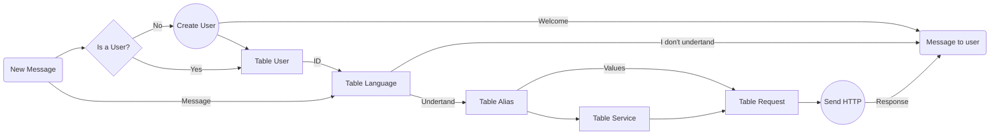

# Bot-assistant-Python

### Tech

* [Telepot](https://github.com/nickoala/telepot) - Python framework for Telegram Bot API


### Installation

Install the dependencies:
```sh
sudo apt-get install python-dev python-pip
pip install telepot psycopg2 configparser matplotlib pip psycopg2-binary
```

Clone the aplication:
```sh
git clone https://github.com/ViniciusEMonteiro/Bot-assistant-Python.git
cd Bot-assistant-Python/
```

Start aplication:
```sh
python main.py
```

Or start in background:
```sh
nohup python main.py &
```

Or create a service to run:
```sh

```

### Aplication



License
----

* [GNU GENERAL PUBLIC LICENSE](https://github.com/ViniciusEMonteiro/Bot-assistant-Python/blob/master/LICENSE)
----